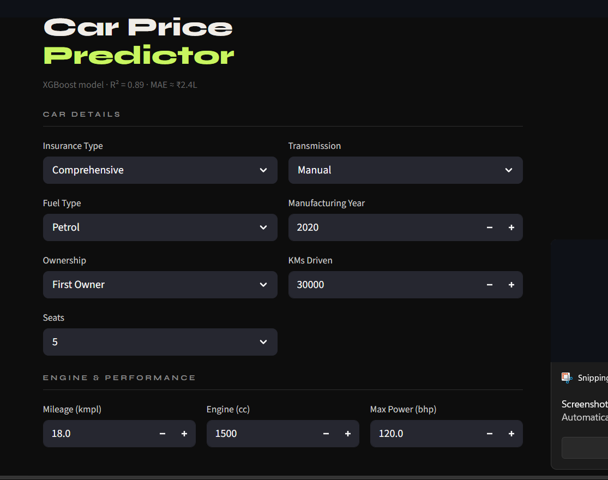
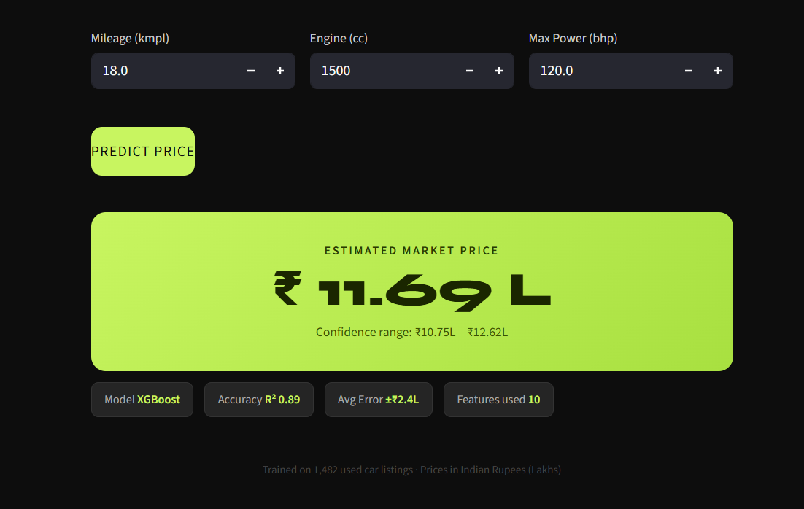

# 🚗 Used Car Price Predictor

A Machine Learning web application that predicts the resale price of used cars based on key features like fuel type, ownership, transmission, and more.


## 📸 Screenshots

### 🏠 Input Interface



### 💰 Prediction Result



---

## 🧠 Model Information

* **Algorithm Used:** KNeighborsRegressor(KNN-3)
* **Features Used:**

  * Insurance Validity
  * Fuel Type
  * Kilometers Driven
  * Ownership
  * Transmission

---

## ✨ Features

* Clean and user-friendly UI
* Dropdown-based inputs (no invalid entries)
* Instant price prediction
* Lightweight and fast

---

## 🛠️ Tech Stack

* Python
* Streamlit
* Scikit-learn
* NumPy

---

## ⚙️ Run Locally

```bash
pip install -r requirements.txt
streamlit run app.py
```

---

## 📂 Project Structure

```
├── app.py
├── final_model.pkl
├── requirements.txt
├── screenshots/
│   ├── home.png
│   └── result.png
```

---

## 📌 Author

**Khushi Potfode**

---

## ⭐ If you like this project

Give it a star on GitHub!
